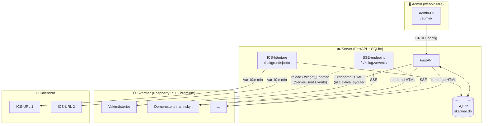
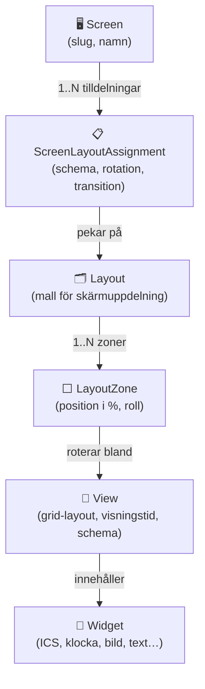
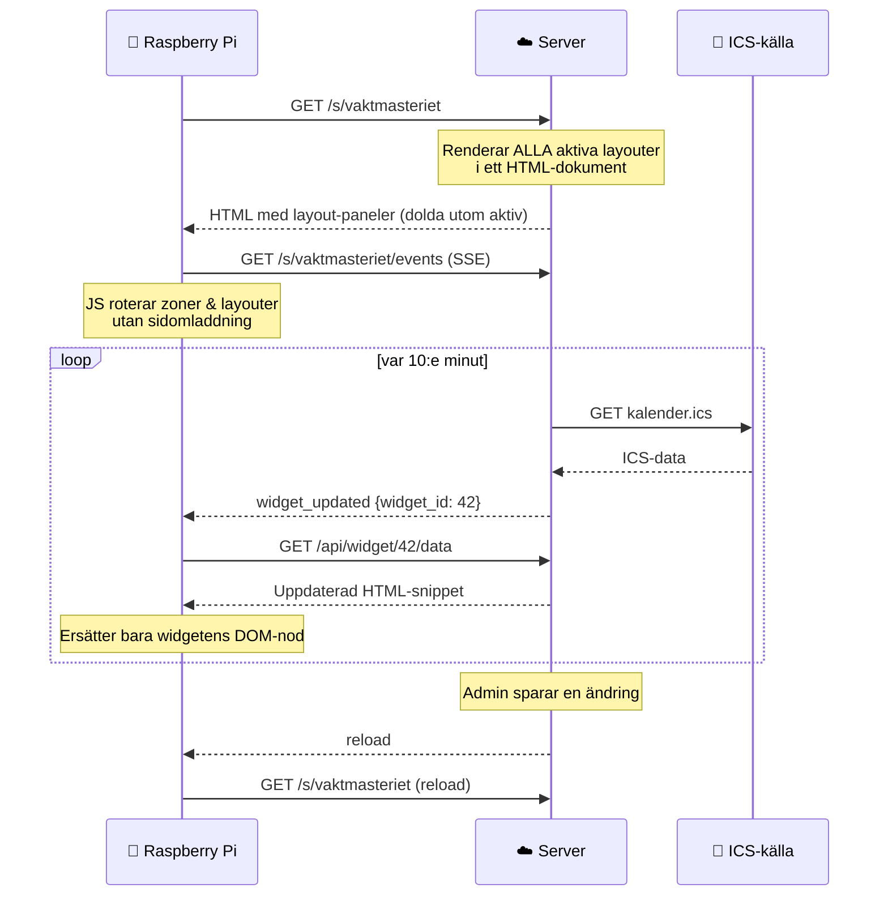

# svk-dash

Informationsskärmar för Svenska kyrkan — en modern ersättare för Dakboard. Varje skärm körs som en URL i Chromium kiosk-läge på en Raspberry Pi och uppdateras i realtid utan omladdning.

---

## Vad är det?

En skärm är en URL. Admin konfigurerar vilka **layouter** som ska visas, vilka **zoner** varje layout innehåller och vilka **vyer** (med widgets) som roterar i varje zon. Skärmarna uppdateras via Server-Sent Events när innehållet förändras.

```
https://skarmar.svky.se/s/vaktmasteriet  →  Raspberry Pi → 55" TV
```

---

## Systemöversikt



---

## Koncepthierarki

En skärm kan ha flera **layouter** som växlar enligt schema. Varje layout delar upp skärmen i **zoner**. Varje zon roterar mellan ett antal **vyer**, och varje vy innehåller ett rutnät av **widgets**.



### Zon-roller

| Roll | Beteende |
|------|----------|
| **Persistent** | Visar alltid samma widget (t.ex. logotyp, klocka) |
| **Schemaläggbar** | Roterar bland sina vyer med konfigurerbar transition |

### Schematyper

Både layoutar och vyer kan schemaläggas med typen:

| Typ | Exempel |
|-----|---------|
| `always` | Visas alltid (standard) |
| `weekly` | Mån–fre kl 08–17 |
| `monthly` | Den 15:e varje månad |
| `yearly` | 24 december |
| `dates` | Specifika datum: 2025-12-23, 2025-12-24 |

---

## Kiosk-klientens flöde

All HTML renderas server-side vid sidladdning. Klienten (vanilla JS, ~700 rader, inga beroenden) hanterar sedan rotation och realtidsuppdateringar lokalt.



---

## Widget-typer

| Widget | Beskrivning |
|--------|-------------|
| `ics_list` | Händelselista med dag-gruppering, auto-scroll |
| `ics_schedule` | Blockschema med tidsaxel och nu-linje |
| `ics_week` | Veckovy i kolumnformat |
| `ics_month` | Månadskalender med flerdagshändelser |
| `clock` | Digital klocka och datum (klientsidigt) |
| `markdown` | Formaterad text, redigeras via delegerad URL |
| `image` | Statisk bild (uppladdning eller extern URL) |
| `slideshow` | Roterande bilder med fade/slide/wipe/zoom |
| `color_block` | Enfärgad yta (bakgrund, separator) |
| `raw_html` | Godtycklig HTML (admin-only) |

---

## Köra lokalt

```bash
# Installera beroenden
uv sync

# Kör migrationer
uv run alembic upgrade head

# Generera adminlösenord
python3 -c "import bcrypt; print(bcrypt.hashpw(b'ditt-lösen', bcrypt.gensalt()).decode())"

# Starta dev-server
ADMIN_PASSWORD_HASH='$2b$12$...' uv run uvicorn app.main:app --reload >> dev.log 2>&1 &
tail -f dev.log
```

Admin-UI: `http://localhost:8000/admin/`  
Kiosk-vy: `http://localhost:8000/s/<slug>`

---

## Deployment

```bash
# Bygg och starta
docker compose up -d

# Miljövariabler (se .env.example)
SECRET_KEY=...
ADMIN_PASSWORD_HASH=...
DATABASE_PATH=data/skarmar.db
BASE_URL=https://skarmar.svky.se
```

Caddy hanterar TLS automatiskt. Databasen och uppladdade filer lagras i `data/`-volymen.

### Backup

```bash
# SQLite live-backup (säker under drift)
sqlite3 data/skarmar.db ".backup data/backup-$(date +%F).db"

# Uploads
tar czf uploads-$(date +%F).tar.gz data/uploads/
```

---

## Kiosk-setup (Raspberry Pi)

Se `deploy/kiosk-setup/` för bootstrap-skript. Kortversion:

```bash
# Chromium i kiosk-läge (Pi 3/4/5)
chromium-browser --kiosk --noerrdialogs --disable-infobars \
  https://skarmar.svky.se/s/<slug>
```

**Viktigt:** Pi:er saknar RTC. Bootstrap-skriptet väntar på NTP-synkronisering innan Chromium startas, annars tolkas ICS-händelser som år 1970.

---

## Projektstruktur

```
app/
  main.py           # FastAPI-app, lifespan, middleware
  models.py         # SQLModel-modeller
  database.py       # SQLite-engine, WAL, get_session()
  templating.py     # Jinja2-instans med filter
  routes/
    admin/          # Admin-UI (CRUD, layout-editor, media)
    kiosk.py        # Kiosk-endpoint, SSE, widget-API
  widgets/          # Renderers per widget-typ
  services/         # ICS-hämtare, layout-schemaläggare
  static/
    kiosk.js        # Kiosk-klient (vanilla JS, ~700 rader)
  templates/
    admin/          # Jinja2-templates för admin
    kiosk/          # screen.html (kioskvy)
alembic/            # Databasmigrationer
deploy/
  kiosk-setup/      # RPi bootstrap-skript
data/               # SQLite-DB och uploads (gitignorerat)
```
